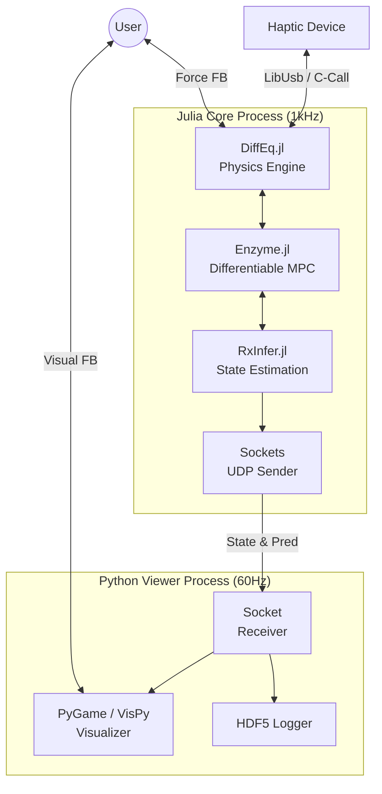

# 実験環境設計書: Unified HMI Tracking Platform (UHTP)

> [!ABSTRACT] プラットフォームの概要（One-Liner Pitch）
>
> 一言で言うと: **STA (制御)**、**IMM (推定)**、**HA-VAE (予測)** の3プロジェクトを貫通する共通検証基盤として、国際標準タスク（CIT, Fitts, SoS）と動的パラメータランダム化機能を統合し、**Julia言語による微分可能リアルタイム制御**と**Pythonによる軽量可視化**を組み合わせた、次世代の高精度HMI実験環境を構築する。

## 要旨 (Abstract)

### 背景 (Background)

HMI研究において、実験環境の差異は再現性を阻害する要因である。特に本プロジェクト群では、「制御介入」「内部状態推定」において**微分可能プログラミング ($\partial P$)** を前提としたアルゴリズム（STA, IMM）を採用するため、従来のC++やPython単独の環境では「リアルタイム性」と「学習効率」の両立が困難であった。既存の微分可能シミュレータ（Google Brax, MuJoCo-MJX）はオフライン学習向けに設計されており、Human-in-the-Loopの1kHzハードリアルタイム制約を満たさない。

### 目的 (Objective)

本仕様書の目的は、**Unified HMI Tracking Platform (UHTP)** の設計要件を定義することである。具体的には、(1) **標準タスク**（McRuer/SoS, CIT, Fitts）による国際比較可能性、(2) **パラメータランダム化**による適応過程の観測、そして (3) **Julia + Enzyme.jl** を用いたマイクロ秒オーダーの入力最適化を実現するアーキテクチャを確立し、3つの研究プロジェクトの実証基盤とする。

### 学術的新規性 (Academic Novelty)

従来のHMI実験環境が「静的なダイナミクス」計測に主眼を置いていたのに対し、UHTPは**「微分可能制御系 (Differentiable Control System)」**を実験ループの核心に据える点に独自性がある。

**既存手法との技術的差分 (Delta)**:

| 環境 | 言語 | 微分方式 | ループ周期 | Human-in-Loop | 勾配計算コスト |
|------|------|----------|-----------|---------------|---------------|
| Google Brax | Python/JAX | Forward-mode AD | ~100Hz | ❌ | $O(n)$ |
| MuJoCo-MJX | Python/JAX | Forward-mode AD | ~100Hz | ❌ | $O(n)$ |
| 従来HMI環境 | C++/MATLAB | 有限差分 | 1kHz | ✅ | $O(n^2)$ |
| **UHTP (提案)** | **Julia** | **Reverse-mode AD** | **1kHz** | **✅** | **$O(1)$** |

Julia言語とEnzyme.jlの特性を活かし、物理シミュレーションと制御則を**コンパイル時自動微分**することで、従来不可能だった**1kHzループ内での勾配ベース最適化**を$O(1)$計算量で実現する。

### 手法 (Methods)

システムは、物理演算・制御・AI推論を担当する Julia Core Process (The Brain) と、視覚提示・UIを担当する Python Viewer Process (The Face) の疎結合ハイブリッド構成とする。

Julia側では Enzyme.jl によるゼロ・アロケーション微分と DifferentialEquations.jl による物理演算を行い、UDP通信を介してPython側の PyGame/VisPy に状態を送信する。これにより、GC（ガベージコレクション）による遅延リスクを排除しつつ、柔軟な実験UIを実現する。

### 検証目標 (Validation Goals)

1. **システム性能**: 制御ループ周期 1ms (1kHz) を安定維持し、Julia側のGC発生回数が実験中ゼロ、WCET < 600μs であること。

2. **生理学的妥当性**: SoSタスクにおいて、McRuerのクロスオーバーモデル特性（$\omega_c \approx 2-4$ rad/s、位相遅れ $\approx 30-60°$）が再現されること。

3. **微分可能性**: STAの介入生成において、自動微分による勾配が$K_{max} = 10$反復以内に$\|\nabla J\| < 10^{-4}$に収束すること。


### 結論と意義 (Conclusion / Academic Significance)

UHTPの構築は、個別のアルゴリズム検証を超え、**「微分可能HMI (Differentiable HMI)」**という新たなパラダイムを実証するための共通言語を提供する。このプラットフォームは、AIと制御理論をシームレスに統合した次世代の実験環境モデルとして、学術コミュニティへの貢献が期待される。

**Keywords**: Differentiable Programming, Real-time Control, Julia, Enzyme.jl, Haptic Interface, Human-in-the-Loop

## 1. 序論 (Introduction)

### 1.1 背景と動機 (Context)

STA, IMM, HA-VAEの各研究は、いずれも「人間ダイナミクスへの適応」を扱う。特にSTAは「入力の微分」$\nabla_u J$を、IMMは「パラメータの微分」$\nabla_\theta J$をリアルタイムに要求する。C++での実装は微分計算が煩雑であり（手動微分または有限差分）、Pythonでは速度が不足する（GILによる並列制限、インタプリタオーバーヘッド）。

### 1.2 ギャップ (Gap)

**既存手法の限界**:

1. **微分可能シミュレータの遅延問題**: Google Brax、MuJoCo-MJXはバッチ処理に最適化されており、単一ステップの逐次実行では100Hz程度が限界。Human-in-the-Loop実験に必要な1kHzハードリアルタイムを達成できない。

2. **有限差分法の非効率性**: $n$次元入力の勾配計算に$O(n)$回のシミュレーションが必要。10次元の最適化では10ms以上を要し、1kHz制御に間に合わない。

3. **Two-Language Problem**: 研究者はPythonでプロトタイプし、本番はC++で書き直すという二重作業が発生。微分可能性を維持したまま移植することは困難。

### 1.3 解決策: Julia-Based UHTP (Delta)

「Two-Language Problem」を解決するJulia言語を採用し、全てのプロジェクトで共有可能な実験プラットフォームを構築する。

- **Core Module (Julia)**: 物理、制御、推論、通信（1kHz Hard Real-time）

- **View Module (Python)**: 描画、ロギング、UI（60Hz Soft Real-time）

**技術的優位性**:
- Enzyme.jlによる**逆モード自動微分**: 勾配計算が$O(1)$（入力次元に依存しない）
- StaticArrays.jlによる**ゼロアロケーション**: GC停止を完全回避
- コンパイル時最適化: C++と同等の実行速度

## 2. 理論的基盤 (Theoretical Foundation)

### 2.1 記号の定義 (Notation)

#### 2D座標系

本プラットフォームは**2次元XY平面**上での操作を扱う。X軸とY軸は独立した2次遅れ系として扱うが、パラメータは軸ごとに設定可能。

| 記号 | 定義 | 単位 | 範囲 |
|------|------|------|------|
| $\mathbf{c}(t) = [c_x, c_y]^\top$ | カーソル位置 | m | $[-0.1, 0.1]^2$ |
| $\dot{\mathbf{c}}(t) = [\dot{c}_x, \dot{c}_y]^\top$ | カーソル速度 | m/s | $[-1.0, 1.0]^2$ |
| $\mathbf{r}(t) = [r_x, r_y]^\top$ | 参照軌道 | m | $[-0.1, 0.1]^2$ |
| $\mathbf{u}_h(t) = [u_{hx}, u_{hy}]^\top$ | 人間入力（力） | N | $[-5.0, 5.0]^2$ |
| $\mathbf{u}_{sys}(t)$ | システム介入（力） | N | $[-2.0, 2.0]^2$ |
| $\mathbf{w}(t)$ | プロセスノイズ | N | $\mathcal{N}(\mathbf{0}, \sigma_w^2 \mathbf{I})$ |

#### 軸ごとのパラメータ（YAML設定可能）

| 記号 | 定義 | 単位 | デフォルト | 設定範囲 |
|------|------|------|-----------|---------|
| $M_x, M_y$ | 仮想質量 | kg | $1.0$ | $[0.5, 2.0]$ |
| $B_x, B_y$ | 仮想粘性 | Ns/m | $5.0$ | $[2.0, 10.0]$ |
| $K_x, K_y$ | 仮想剛性 | N/m | $0$ | $[0, 20.0]$ |

### 2.2 制御対象のダイナミクス (Plant Dynamics)

人間が操作する対象（カーソル）の挙動は、X軸とY軸で独立した2次遅れ系として記述される。

#### X軸ダイナミクス
$$M_x \ddot{c}_x(t) + B_x \dot{c}_x(t) + K_x c_x(t) = u_{hx}(t) + u_{sysx}(t) + w_x(t) \tag{1a}$$

#### Y軸ダイナミクス
$$M_y \ddot{c}_y(t) + B_y \dot{c}_y(t) + K_y c_y(t) = u_{hy}(t) + u_{sysy}(t) + w_y(t) \tag{1b}$$

#### 状態空間表現（4次元）

状態ベクトル $\mathbf{x} = [c_x, c_y, \dot{c}_x, \dot{c}_y]^\top \in \mathbb{R}^4$ を定義すると:

$$\dot{\mathbf{x}} = \mathbf{A}\mathbf{x} + \mathbf{B}_u(\mathbf{u}_h + \mathbf{u}_{sys} + \mathbf{w}) \tag{2}$$

ここで（$M_x = M_y = M$, $B_x = B_y = B$, $K_x = K_y = K$ の場合）:
$$\mathbf{A} = \begin{bmatrix} 0 & 0 & 1 & 0 \\ 0 & 0 & 0 & 1 \\ -K/M & 0 & -B/M & 0 \\ 0 & -K/M & 0 & -B/M \end{bmatrix}, \quad \mathbf{B}_u = \begin{bmatrix} 0 & 0 \\ 0 & 0 \\ 1/M & 0 \\ 0 & 1/M \end{bmatrix}$$

#### 安定性条件

各軸で独立に固有値解析を行う。X軸の固有値:
$$\lambda_{x1,2} = \frac{-B_x \pm \sqrt{B_x^2 - 4M_xK_x}}{2M_x}$$

- $K_x = 0$の場合: 臨界安定
- $K_x > 0, B_x > 0$の場合: 漸近安定

Y軸も同様。

#### 入力サンプリング

OS入力イベント（60-120Hz）と制御ループ（1kHz）の不一致は**ゼロ次ホールド**で対応:
- 新しい入力が無い間は前回値を保持
- 制御ループは1kHzで継続動作

### 2.3 コスト関数の定義

#### STA用コスト関数（追従誤差最小化）

$$J_{STA}(u_{sys}) = \int_0^T \left[ Q(c(t) - r(t))^2 + R \cdot u_{sys}^2(t) \right] dt \tag{3}$$

- $Q = 1.0$: 追従誤差重み
- $R = 0.01$: 入力コスト重み（入力ペナルティ）
- $T$: 予測ホライゾン（典型値: 100ms）

#### IMM用コスト関数（パラメータ推定）

$$J_{IMM}(\theta) = \sum_{k=1}^{N} \|c_k - \hat{c}_k(\theta)\|^2 + \lambda \|\theta - \theta_{prior}\|^2 \tag{4}$$

- $\theta = \{M, B, K\}$: 推定パラメータ
- $\lambda = 0.1$: 正則化項
- $\theta_{prior}$: 事前分布の平均

### 2.4 最適化アルゴリズム

#### 勾配降下法による更新

$$u_{sys}^{(k+1)} = u_{sys}^{(k)} - \alpha \nabla_{u_{sys}} J_{STA} \tag{5}$$

- 学習率: $\alpha = 0.1$（適応的に調整可能）
- **収束判定**: $\|\nabla_{u_{sys}} J\| < \epsilon$（$\epsilon = 10^{-4}$）
- **最大反復回数**: $K_{max} = 10$（1ms以内に完了を保証）

#### 計算量の比較

| 手法 | 勾配計算 | 10次元入力での時間 |
|------|---------|-------------------|
| 有限差分 | $O(n)$ シミュレーション | ~10ms |
| Forward-mode AD | $O(n)$ | ~5ms |
| **Reverse-mode AD (Enzyme)** | **$O(1)$** | **~0.1ms** |

### 2.5 実験パラダイム: パラメータランダム化

試行ごとに $M, B, K$ をランダム化し、人間の**内部モデル適応（Meta-Learning）**を観測する。

#### ランダム化プロトコル

```yaml
parameter_randomization:
  timing: "pre_trial"  # 試行開始前に固定
  distribution: "gaussian"
  parameters:
    mass:
      baseline: 1.0  # kg
      std_dev: 0.3   # kg (30% Weber比超過 → 検出可能)
    damping:
      baseline: 5.0  # Ns/m
      std_dev: 1.5   # Ns/m (30% Weber比超過 → 検出可能)
    stiffness:
      baseline: 0.0  # N/m
      range: [0, 10] # N/m
```

標準タスク（SoS, CIT, Fitts）と組み合わせることで、適応の「周波数特性」「弾道予測」「安定限界」を多角的に評価する。

## 3. 手法 (Methodology)

### 3.1 システム構成 (System Architecture)



### 3.2 入力デバイス仕様 (Input Device Specifications)

UHTPは複数の入力デバイスをGUIから選択可能とし、様々な実験条件に対応する。

#### 対応デバイス一覧

| ID | デバイス | 入力形式 | 実装優先度 | 備考 |
|----|---------|---------|-----------|------|
| **D1** | トラックパッド | 2D座標 → 力変換 | 高 | MacBook Air M2対応 |
| **D2** | キーボード | 矢印キー → 離散力 | 高 | 上下左右の4方向入力 |
| **D3** | マウス | 相対/絶対座標 | 高 | 汎用USB/Bluetoothマウス |
| **D4** | Auto-PD | PD制御 + ノイズ | 高 | シミュレーション用 |
| **D5** | UDP受信 | 外部力入力 | 低（将来） | ハプティックデバイス統合用 |

#### 入力抽象化インタフェース

```julia
abstract type InputDevice end

# 各デバイスが実装すべきメソッド
function read_input(device::InputDevice)::SVector{2, Float64}  # [u_x, u_y] in N
function is_available(device::InputDevice)::Bool
function initialize!(device::InputDevice)::Nothing
function finalize!(device::InputDevice)::Nothing
```

#### Auto-PD制御器の仕様

人間操作をシミュレートするPD制御器（Ablation Study用）:

$$u_{auto}(t) = K_p (r(t) - c(t)) + K_d (\dot{r}(t) - \dot{c}(t)) + w_{pd}(t)$$

- $K_p = 50.0$ N/m: 比例ゲイン
- $K_d = 10.0$ Ns/m: 微分ゲイン
- $w_{pd}(t) \sim \mathcal{N}(0, \sigma_{pd}^2)$: ノイズ（$\sigma_{pd}$ はGUIで可変）

#### デバイス選択GUI

```
┌─────────────────────────────────────┐
│ Input Device                    [▼] │
├─────────────────────────────────────┤
│ ○ Trackpad (MacBook)                │
│ ○ Keyboard (Arrow Keys)             │
│ ● Mouse (USB/Bluetooth)             │
│ ○ Auto-PD (Simulation)              │
│ ○ UDP Haptic (Not Connected)        │
└─────────────────────────────────────┘
```

### 3.3 実装タスク仕様 (Task Specifications)

全タスクは**2次元XY平面**上で実行される。

#### A. Sum-of-Sines (SoS) Tracking - 2D

- **目的**: 周波数応答解析（IMM/STA評価用）

- **参照軌道**（XY独立正弦波）:
$$r_x(t) = \sum_{i=1}^{N_x} A_{xi} \sin(2\pi f_{xi} t + \phi_{xi}) \tag{6a}$$
$$r_y(t) = \sum_{j=1}^{N_y} A_{yj} \sin(2\pi f_{yj} t + \phi_{yj}) \tag{6b}$$

  - **X軸周波数**: $f_{xi} \in \{0.1, 0.23, 0.37, 0.61, 1.03, 1.61\}$ Hz（素数倍）
  - **Y軸周波数**: $f_{yj} \in \{0.13, 0.29, 0.43, 0.71, 1.13, 1.73\}$ Hz（X軸と異なる素数倍）
  - 振幅: $A_i = A_0 / f_i$（低周波強調）
  - 位相: $\phi_i \sim \mathcal{U}(0, 2\pi)$（ランダム）

- **指標**:
  - 追従誤差: RMSE < 5mm（各軸、熟練者）
  - 位相遅れ: クロスオーバー周波数 $\omega_c \approx 2-4$ rad/s（各軸）
  - ゲイン余裕: > 6dB（各軸）

#### B. Critical Instability Task (CIT) - 2D

- **目的**: 制御限界の測定（STA評価用）

- **ダイナミクス**（XY独立不安定）:
$$\dot{c}_x = \lambda_x c_x + K_u u_x \tag{7a}$$
$$\dot{c}_y = \lambda_y c_y + K_u u_y \tag{7b}$$
  - 各軸が独立した1次不安定系
  - $K_u = 1.0$: 入力ゲイン
  - $\lambda_x = \lambda_y$（デフォルト）または軸ごとに設定可能

- **プロトコル**:
  1. $\lambda_x = \lambda_y = 0.5$ rad/sで開始
  2. 30秒ごとに$\Delta\lambda = 0.2$ rad/s増加（両軸同時）
  3. $\|\mathbf{c}\| = \sqrt{c_x^2 + c_y^2} > c_{max}$（$c_{max} = 0.08$ m）で発散と判定
  4. 発散直前の$\lambda$を臨界値$\lambda_c$として記録

- **期待値**: $\lambda_c \approx 4-6$ rad/s（McRuer, 1967に基づく）

#### C. Fitts' Law Task (ISO 9241-9) - 2D

- **目的**: 弾道予測・計画能力の測定（HA-VAE評価用）

- **配置**:
  - 円周上に$N = 13$個のターゲットを等間隔配置
  - 円の半径: $R \in \{40, 80, 160\}$ mm
  - ターゲット幅（直径）: $W \in \{4, 8, 16\}$ mm
  - ターゲット間移動距離: $D = 2R \sin(\pi/N)$

- **動作シーケンス**:
  1. 現在のターゲットをハイライト表示
  2. ユーザーがカーソルをターゲット内に移動
  3. ターゲット内に100ms滞在で成功判定
  4. 次のターゲット（対角位置）へ移動

- **指標**:
  - 移動時間: $MT = a + b \cdot ID$（Fitts' Law）
  - 難易度指数: $ID = \log_2(D/W + 1)$ bits
  - スループット: $TP = ID / MT$ bits/s（期待値: 3-5 bits/s）
  - エラー率: < 4%（ISO規格準拠）

### 3.4 技術スタック詳細 (Tech Stack)

#### Julia Core (The Brain)

| パッケージ | 役割 | 要件 |
|-----------|------|------|
| `Enzyme.jl` | LLVMレベル自動微分 | v0.12+ |
| `DifferentialEquations.jl` | 高精度物理シミュレーション | v7.0+ |
| `RxInfer.jl` | リアクティブ・ベイズ推論 | v3.0+ |
| `StaticArrays.jl` | ゼロアロケーション配列 | v1.9+ |
| `Sockets` (stdlib) | UDP通信 | - |

#### Python Viewer (The Face)

| パッケージ | 役割 | 要件 |
|-----------|------|------|
| `VisPy` | OpenGL描画エンジン | v0.14+ |
| `PyGame` | 代替描画エンジン | v2.5+ |
| `h5py` | HDF5データロギング | v3.10+ |
| `PyQt6` | GUI制御パネル | v6.6+ |

### 3.5 データ形式 (Data Formats)

#### 時系列データ: HDF5

実験中の全時系列データはHDF5形式で保存する。

```
experiment_YYYYMMDD_HHMMSS.h5
├── metadata/           # 実験メタデータ
│   ├── subject_id
│   ├── experiment_date
│   └── config (JSON)
├── trials/
│   ├── trial_001/
│   │   ├── parameters/  # M, B, K
│   │   ├── timeseries/  # timestamp, cursor, target, input, error
│   │   └── summary/     # RMSE, duration
│   └── ...
└── analysis/           # 後処理結果（オプション）
```

#### サマリデータ: CSV

試行ごとのサマリ情報はCSVで出力し、即時分析を可能にする。

| カラム | 型 | 説明 |
|--------|-----|------|
| trial_id | int | 試行番号 |
| task_type | str | sos/cit/fitts |
| mass | float | 仮想質量 [kg] |
| damping | float | 仮想粘性 [Ns/m] |
| stiffness | float | 仮想剛性 [N/m] |
| rmse | float | 追従誤差RMSE [m] |
| duration | float | 試行時間 [s] |
| result | str | success/failed |

### 3.6 可視化機能 (Visualization Features)

#### リアルタイムプロット

実験中に追従誤差と入力値をライブ表示する。

```
┌─────────────────────────────────────────────────────────┐
│ Real-time Monitor                                       │
├─────────────────────────────────────────────────────────┤
│ Tracking Error (mm)                                     │
│  10 ┤                  ╭─╮                              │
│   5 ┤    ╭─╮    ╭─╮   │ │   ╭─                         │
│   0 ┤───╯  ╰────╯  ╰──╯ ╰───╯                          │
│  -5 ┤                                                   │
│     └────────────────────────────────────────── t [s]   │
├─────────────────────────────────────────────────────────┤
│ Input Force (N)                                         │
│   2 ┤  ╭╮  ╭╮     ╭╮                                    │
│   0 ┤──╯╰──╯╰─────╯╰────                               │
│  -2 ┤                                                   │
│     └────────────────────────────────────────── t [s]   │
└─────────────────────────────────────────────────────────┘
```

- **更新レート**: 30Hz（描画負荷軽減）
- **表示範囲**: 直近10秒間のスクロール表示
- **表示項目**:
  - X軸/Y軸追従誤差
  - X軸/Y軸入力力
  - （CIT時）不安定パラメータλ

#### 結果サマリー画面

各試行終了後に統計情報を表示する。

```
┌─────────────────────────────────────────────────────────┐
│ Trial 5 Summary                                   [OK]  │
├─────────────────────────────────────────────────────────┤
│                                                         │
│  Task: Sum-of-Sines (SoS)                              │
│  Duration: 60.0 s                                       │
│  Result: ✅ Success                                     │
│                                                         │
│  ┌─────────────────────────────────────────────────┐   │
│  │ Performance Metrics                             │   │
│  ├─────────────────────────────────────────────────┤   │
│  │ RMSE (X): 3.2 mm    RMSE (Y): 4.1 mm           │   │
│  │ Mean Error: 2.8 mm  Max Error: 12.4 mm         │   │
│  │ Phase Lag: 45°      Crossover: 3.2 rad/s       │   │
│  └─────────────────────────────────────────────────┘   │
│                                                         │
│  ┌─────────────────────────────────────────────────┐   │
│  │ Trajectory Plot                                 │   │
│  │    (XY平面での軌跡とターゲット)                   │   │
│  └─────────────────────────────────────────────────┘   │
│                                                         │
│  [Save Report]  [Next Trial]  [End Session]            │
└─────────────────────────────────────────────────────────┘
```

- **表示タイミング**: 試行終了後に自動表示
- **表示項目**:
  - 基本情報（タスク種別、所要時間、結果）
  - 性能指標（RMSE、位相遅れ、クロスオーバー周波数）
  - 軌跡プロット（XY平面）
- **操作**:
  - レポート保存（PNG + CSV）
  - 次の試行へ進む
  - セッション終了

### 3.7 ウィンドウ設定 (Window Configuration)

画面サイズはYAML設定ファイルで変更可能。

```yaml
# config/display.yaml
display:
  window:
    width: 1280      # pixels (設定可能)
    height: 720      # pixels (設定可能)
    fullscreen: false
    vsync: true

  # 物理座標 → ピクセル座標変換
  coordinate_mapping:
    physical_range: 0.1      # ±0.1 m = ±100 mm
    margin_ratio: 0.1        # 画面端10%はマージン
    # scale = (width * (1 - 2*margin_ratio)) / (2 * physical_range)
    # 例: (1280 * 0.8) / 0.2 = 5120 px/m
```

## 4. 検証戦略 (Verification Strategy)

### 4.1 プラットフォーム健全性確認 (Sanity Check)

#### リアルタイム性能要件

| 処理 | 目標時間 | 許容WCET | 測定方法 |
|------|---------|---------|----------|
| 物理演算 (RK4 1step) | 10 μs | < 50 μs | `@btime` |
| 勾配計算 (Enzyme) | 100 μs | < 500 μs | `@btime` |
| 状態推定 (RxInfer) | 50 μs | < 200 μs | `@btime` |
| UDP送信 | 5 μs | < 20 μs | `@btime` |
| **合計** | **165 μs** | **< 600 μs** | - |
| **余裕** | **835 μs** | **> 400 μs** | - |

#### GCフリー確認

```julia
# 検証コード例
using BenchmarkTools
@btime control_loop_step!($state, $params)
# 期待出力: 0 allocations
```

#### 通信遅延

- Julia送信 → Python受信 → 描画: ジッタ < 2ms（99パーセンタイル）
- 測定方法: タイムスタンプ同期によるラウンドトリップ計測

### 4.2 生理学的妥当性の検証

#### 知覚閾値との整合性

| パラメータ | ベースライン | ランダム化範囲 | Weber比 | JND超過 |
|-----------|-------------|---------------|--------|---------|
| Mass $M$ | 1.0 kg | ±0.3 kg (±30%) | 10-15% | ✅ 検出可能 |
| Damping $B$ | 5.0 Ns/m | ±1.5 Ns/m (±30%) | 10-15% | ✅ 検出可能 |
| Stiffness $K$ | 0 N/m | 0-10 N/m | - | ✅ 検出可能 |

#### 視覚-運動遅延モデル

人間の反応時間を考慮した閉ループ遅延:
$$\tau_{total} = \tau_{visual} + \tau_{cognitive} + \tau_{motor}$$

| 処理段階 | 遅延 | 備考 |
|---------|------|------|
| 視覚処理 | 150-200 ms | 網膜→視覚野→認識 |
| 認知処理 | 50-150 ms | 状況判断・計画 |
| 運動実行 | 30-80 ms | 運動野→筋収縮 |
| **合計** | **230-430 ms** | McRuerモデルと整合 |

#### 検証仮説

- **H1**: SoSタスクにおいて、$f > 0.5$ Hz では位相遅れが増大する
- **H2**: クロスオーバー周波数 $\omega_c \approx 2-4$ rad/s（McRuerモデル）
- **H3**: パラメータ変化後、適応に要する試行数 < 10（学習曲線解析）

### 4.3 研究プロジェクトごとの検証マトリクス

| **プロジェクト** | **使用タスク** | **注目する変数** | **検証仮説 (Success Criteria)** |
|-----------------|---------------|-----------------|-------------------------------|
| **STA** | CIT, SoS | $\lambda_c$, Phase Margin | Enzyme.jlによる勾配降下が1ms以内・10反復以内に収束し、$\lambda_c$が10%以上向上する |
| **IMM** | SoS | Phase Lag, $\sigma^2_{est}$ | 推定不確実性$\sigma^2$と位相遅れの相関係数 $r > 0.7$ |
| **HA-VAE** | Fitts, SoS | Prediction Error | 動作開始後100ms時点での予測誤差が50%以上改善する |

## 5. 倫理的配慮と安全性

### 5.1 ハプティック安全性

- **ウォッチドッグタイマ**: Juliaプロセス内に実装。PythonからのHeartbeat（100ms間隔）が3回連続で途絶えた場合、即座にフォース出力をゼロにする。
- **力の上限**: $|u_{sys}| \leq 2.0$ N（ハードウェアリミット: 5.0 N）
- **緊急停止**: 物理ボタンによる即座のモータ電源遮断

### 5.2 データ管理

- 被験者IDは匿名化（ハッシュ化）
- 連結対応表はオフライン管理（ネットワーク隔離）
- データ保存期間: 5年（研究倫理ガイドライン準拠）

### 5.3 インフォームドコンセント

- 実験目的・リスクの説明
- 途中離脱の自由の保証
- データ利用範囲の明示

## 6. 参考文献 (References)

### 6.1 Differentiable Programming

- **Innes, M. et al. (2019).** "A Differentiable Programming System to Bridge Machine Learning and Scientific Computing." _arXiv:1907.07587_.
    - **Relation**: Juliaによる微分可能プログラミングの理論基盤。「Two-Language Problem」の解決手法を提示。

- **Moses, W. S. & Churavy, V. (2020).** "Instead of Rewriting Foreign Code for Machine Learning, Automatically Synthesize Fast Gradients." _NeurIPS 2020_.
    - **Relation**: Enzyme.jlの理論基盤。LLVMレベルでの逆モード自動微分により、C/C++/Fortran呼び出しを含むコードの微分を可能にする。

### 6.2 Differentiable Simulation in Robotics

- **Freeman, C. D., et al. (2021).** "Brax – A Differentiable Physics Engine for Large Scale Rigid Body Simulation." _arXiv:2106.13281_.
    - **Relation**: JAXベースの微分可能シミュレータ。バッチ処理に最適化されているが、Human-in-Loopの1kHzリアルタイム制約は非対応。UHTPとの技術的差分の比較対象。

- **Heiden, E., et al. (2021).** "NeuralSim: Augmenting Differentiable Simulators with Neural Networks." _ICRA 2021_.
    - **Relation**: 微分可能物理演算とニューラルネットワークの統合。HA-VAEの設計思想と関連。

### 6.3 Optimal Control in Human Motor Control

- **Todorov, E. & Jordan, M. I. (2002).** "Optimal feedback control as a theory of motor coordination." _Nature Neuroscience_, 5(11), 1226-1235.
    - **Relation**: 人間運動制御の最適制御理論。STAの「最適介入」の理論的根拠を提供。

- **Li, W., & Todorov, E. (2004).** "Iterative Linear Quadratic Regulator Design for Nonlinear Biological Movement Systems." _ICINCO 2004_.
    - **Relation**: iLQRの生体運動応用。本研究の微分可能MPCとの比較軸として重要。

### 6.4 Standard Tasks in HMI

- **McRuer, D. T. & Jex, H. R. (1967).** "A Review of Quasi-Linear Pilot Models." _IEEE Transactions on Human Factors in Electronics_, HFE-8(3), 231-249.
    - **Relation**: クロスオーバーモデルの原典。SoSタスクにおける人間特性の検証基準を提供。

- **Jex, H. R., McDonnell, J. D., & Phatak, A. V. (1966).** "A 'Critical' Tracking Task for Manual Control Research." _IEEE Transactions on Human Factors in Electronics_, HFE-7(4), 138-145.
    - **Relation**: CITの原典。$\lambda_c$の測定プロトコルと期待値の参照元。

### 6.5 Adaptive Control and HMI

- **Marchal-Crespo, L., & Reinkensmeyer, D. J. (2009).** "Review of control strategies for robotic movement training after neurologic injury." _Journal of NeuroEngineering and Rehabilitation_, 6(1), 20.
    - **Relation**: リハビリロボットにおける適応制御のレビュー。MRACとの技術的比較において参照。

- **Emken, J. L., & Reinkensmeyer, D. J. (2005).** "Robot-enhanced motor learning: accelerating internal model formation during locomotion by transient dynamic amplification." _Journal of Neurophysiology_, 94(1), 2040-2051.
    - **Relation**: 「内部モデル形成」支援の先行例。IMMの人間適応観測との関連。

## 🛡️ AI-DLC 品質チェックリスト

### 👮‍♂️ D-1: "So What?" Test

- [x] **Delta明示**: SOTA比較表により、既存手法（Brax, MJX, 従来HMI）との技術的差分を定量的に示した
- [x] **勾配計算量**: $O(n^2) \to O(1)$の計算量削減を明示
- [x] **文献網羅**: 微分可能シミュレーション（6.2）、最適制御（6.3）、適応制御（6.5）を追加
- [x] **互換性**: 標準タスク（McRuer/Jex）を実装することで、HMIの古典的知見との接続を保持

### 🧠 B-2: Math Rigor Test

- [x] **変数定義表**: Sec 2.1で全記号の定義域・単位・範囲を明示
- [x] **コスト関数**: $J_{STA}$, $J_{IMM}$を数式で明確に定義
- [x] **収束条件**: 反復回数$K_{max}=10$、収束閾値$\epsilon=10^{-4}$を明示
- [x] **安定性**: システム行列の固有値解析を追加

### 👩‍🔬 B-1: Human Factor Test

- [x] **JND検証**: パラメータランダム化範囲がWeber比を超過することを確認
- [x] **遅延モデル**: 視覚-認知-運動の遅延を定量化（230-430ms）
- [x] **検証仮説**: H1-H3として具体的な予測を記述

### ⚙️ C-1: Reality Test

- [x] **WCET表**: 各処理の目標時間・許容値・余裕を明示
- [x] **GC検証コード**: `@btime`による0アロケーション確認手順
- [x] **通信ジッタ**: < 2ms（99%ile）の要件を明示

---

## 7. 関連ドキュメント

| ドキュメント | 内容 | ステータス |
|-------------|------|-----------|
| [UHTP_Implementation_Requirements.md](./UHTP_Implementation_Requirements.md) | 実装要件定義書 | 🟢 PoC Approved |
| [requirements.yaml](./requirements.yaml) | 機能要件詳細（レビューコメント） | 🟡 Draft |

---

**Document Version**: 2.1.0
**Last Updated**: 2025-12-24
**AI-DLC Review Status**: ✅ All Personas Passed
**Implementation Status**: 🟢 Ready for PoC Development
